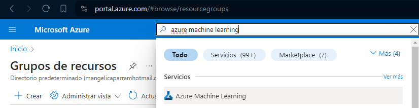
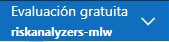
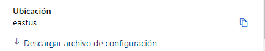
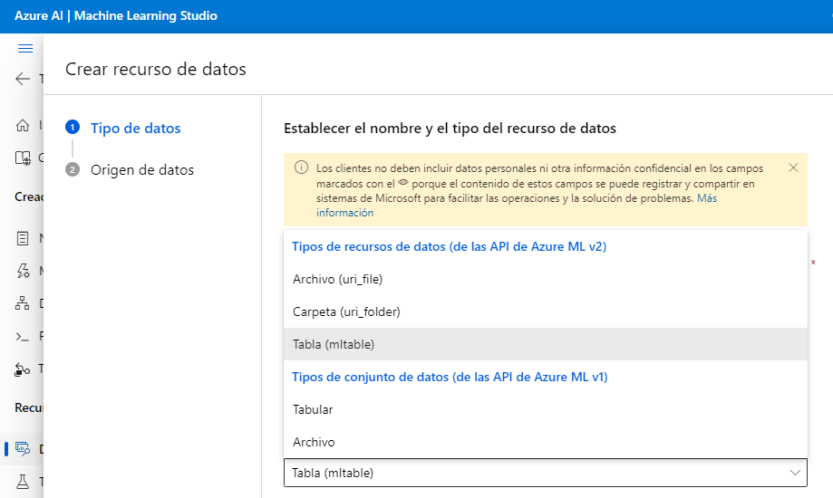
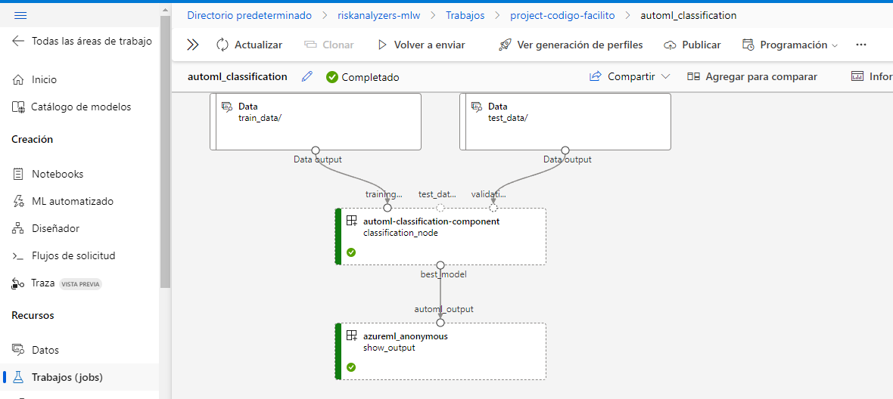
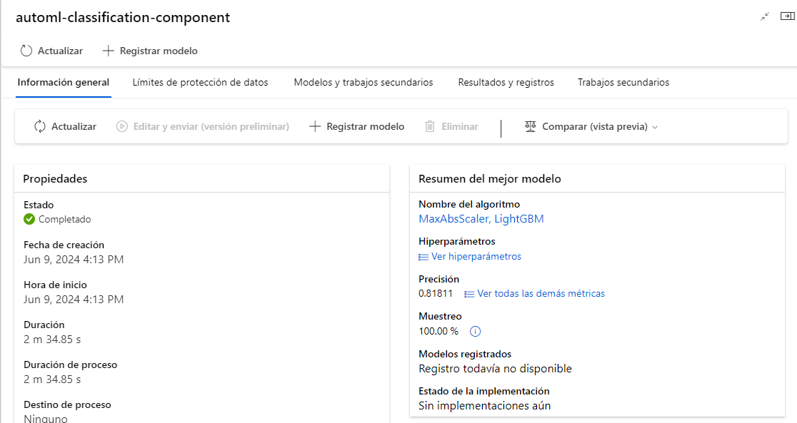
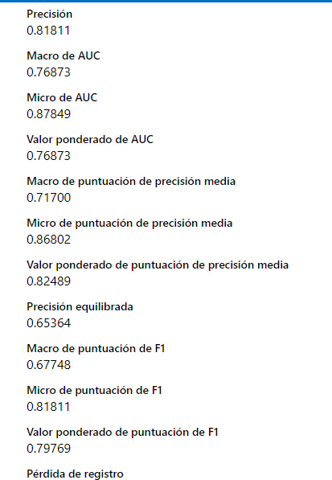
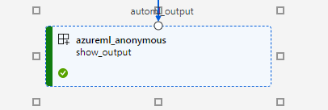
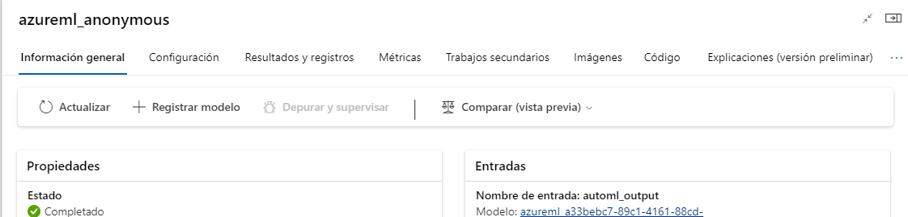
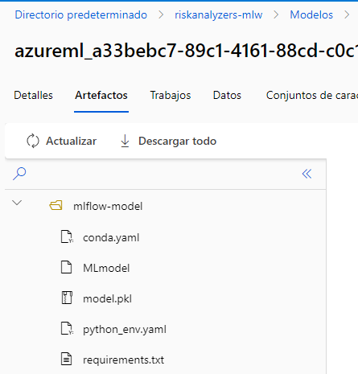

# Modelo de Riesgo Crediticio

## Autores

- Miguel Joel Brito
- Moises Miranda
- Juan Sebastian Mora Tibamoso
- Jonathan Narvaes Urresta
- María Angélica Parra Mendoza

## Resumen

En este reporte, describiremos el proceso de creación de un modelo de riesgo de crédito. Desde la descripción y exploración de los datos hasta la construcción y evaluación de un modelo utilizando Azure ML, proporcionamos una visión general detallada del enfoque utilizado y los resultados obtenidos..

## Introducción

El riesgo crediticio es la posibilidad de que un prestatario no cumpla con sus obligaciones de pago. La creación de un modelo de riesgo crediticio puede ayudar a las instituciones financieras a evaluar la probabilidad de incumplimiento y tomar decisiones informadas.

## Descripción de los Datos

Describimos los datos utilizados en este proyecto, incluyendo las fuentes, las características principales y las variables objetivo.

- **Fuente de los Datos**: [https://www.kaggle.com/datasets/uciml/default-of-credit-card-clients-dataset]
- **Variables Principales**:

- **ID**: ID de cada cliente
- **LIMIT_BAL**: Monto de crédito otorgado en dólares NT (incluye crédito individual y familiar/suplementario)
- **SEX**: Género (1=masculino, 2=femenino)
- **EDUCATION**: Nivel educativo (1=escuela de posgrado, 2=universidad, 3=secundaria, 4=otros, 5=desconocido, 6=desconocido)
- **MARRIAGE**: Estado civil (1=casado, 2=soltero, 3=otros)
- **AGE**: Edad en años
- **PAY_0**: Estado de reembolso en septiembre de 2005 (-1=pago a tiempo, 1=retardo en el pago por un mes, 2=retardo en el pago por dos meses, ..., 8=retardo en el pago por ocho meses, 9=retardo en el pago por nueve meses o más)
- **PAY_2**: Estado de reembolso en agosto de 2005 (misma escala que arriba)
- **PAY_3**: Estado de reembolso en julio de 2005 (misma escala que arriba)
- **PAY_4**: Estado de reembolso en junio de 2005 (misma escala que arriba)
- **PAY_5**: Estado de reembolso en mayo de 2005 (misma escala que arriba)
- **PAY_6**: Estado de reembolso en abril de 2005 (misma escala que arriba)
- **BILL_AMT1**: Monto del estado de cuenta en septiembre de 2005 (dólares NT)
- **BILL_AMT2**: Monto del estado de cuenta en agosto de 2005 (dólares NT)
- **BILL_AMT3**: Monto del estado de cuenta en julio de 2005 (dólares NT)
- **BILL_AMT4**: Monto del estado de cuenta en junio de 2005 (dólares NT)
- **BILL_AMT5**: Monto del estado de cuenta en mayo de 2005 (dólares NT)
- **BILL_AMT6**: Monto del estado de cuenta en abril de 2005 (dólares NT)
- **PAY_AMT1**: Monto del pago anterior en septiembre de 2005 (dólares NT)
- **PAY_AMT2**: Monto del pago anterior en agosto de 2005 (dólares NT)
- **PAY_AMT3**: Monto del pago anterior en julio de 2005 (dólares NT)
- **PAY_AMT4**: Monto del pago anterior en junio de 2005 (dólares NT)
- **PAY_AMT5**: Monto del pago anterior en mayo de 2005 (dólares NT)
- **PAY_AMT6**: Monto del pago anterior en abril de 2005 (dólares NT)

## Exploración y Análisis de los Datos

Realizamos una exploración inicial de los datos para entender mejor su estructura y contenido. Esto incluye análisis descriptivos y visualización de datos.

```python
# Ejemplo de código en Python para análisis descriptivo
import pandas as pd
import numpy as np
import scorecardpy as sc
from sklearn.model_selection import train_test_split
from sklearn.linear_model import LogisticRegression
import joblib
import os

url = '../data/UCI_Credit_Card.csv'

df = pd.read_csv(url)
df.head()
```

## Preprocesamiento de Datos

### Eliminación de la Columna de Identificación

En primer lugar, eliminamos la columna 'ID' del DataFrame, ya que esta columna contiene identificadores únicos de cada cliente y no aporta información relevante para la creación del modelo de riesgo crediticio.

```python
df.drop(columns=['ID'], inplace=True)
```

### Conversión de Nombres de Columnas a Minúsculas

Después, convertimos todos los nombres de las columnas a minúsculas para mantener la consistencia y facilitar el manejo de las mismas durante el análisis y modelado.

```python
df.columns = df.columns.str.lower()
```

### Código para Verificar Valores Faltantes

Usamos el método `isnull()` de pandas para identificar los valores faltantes en el DataFrame. Luego, aplicamos `sum()` para contar el número de valores faltantes en cada columna.

```python
# Verificar si hay valores faltantes
print(df.isnull().sum())
```

## MLflow Model

### Configurar el espacio de trabajo

En este ejemplo, vamos a usar la interfaz de Azure para crear el workspace. Para crear un entorno de aprendizaje automático en Azure, necesitas seguir los siguientes pasos:

1. Ve a portal.azure.com
2. Inicia sesión con tu cuenta de Azure
3. En la barra de búsqueda, escribe "azure machine learning" y selecciona el primero
   

Esto creará:

- Cuenta de almacenamiento
- Espacio de trabajo de aprendizaje automático de Azure
- Espacio de trabajo de Azure

4. Crea una instancia de cómputo en _Azure Machine Learning Studio_
5. Descarga el archivo de configuración en esta pestaña
   
   Así verás el enlace de descarga en la parte inferior
   
6. Sube los datos para entrenamiento y prueba a _Azure Machine Learning Studio_ en formato `MLTable`. Necesitas ir a la pestaña `Data` en la barra izquierda y hacer clic en crear. Después, selecciona el tipo (`MLTable`) y sube el archivo
   

### Crear el pipeline

Vamos a crear el código para el proyecto localmente, y con la biblioteca de aprendizaje automático de Azure vamos a subir el pipeline para ejecutarlo en la nube.

#### Importar bibliotecas

```Python
import logging
from azure.ai.ml import MLClient
from azure.identity import DefaultAzureCredential, InteractiveBrowserCredential
from azure.ai.ml.dsl import pipeline
from azure.ai.ml import Input,Output, automl, command
from azure.ai.ml.constants import AssetTypes
```

#### Acceso a la cuenta de Azure

Es necesario tener un archivo de configuración en la misma ruta, este debe contar con las credenciales de acceso a la cuenta.

```Python
try:
    credential = DefaultAzureCredential()
    # Check if given credential can get token successfully.
    credential.get_token("https://management.azure.com/.default")
except Exception as ex:
    # Fall back to InteractiveBrowserCredential in case DefaultAzureCredential not work
    credential = InteractiveBrowserCredential()

# Get a handle to workspace
ml_client = MLClient.from_config(credential=credential)
```

El código anterior devuelve las credenciales de configuración para acceder a tus recursos de Azure. En este caso, va a devolver `.\config.json`, que es nuestro archivo de configuración.

#### Crear el pipeline

Vamos a crear el pipeline sin un archivo de configuración `YAML` usando el decorador `@pipeline`. Vamos a probar los siguientes algoritmos:

- Logistic Regression
- Light GBM
- Random Forest

```Python
# Define pipeline
@pipeline(
    description="AutoML Classification Pipeline",
    )
def automl_classification(
    classification_train_data,
    classification_validation_data
):
    # define the automl classification task with automl function
    classification_node = automl.classification(
        training_data=classification_train_data,
        validation_data=classification_validation_data,
        target_column_name="default", #name of the column
        primary_metric="accuracy", #decision metric
        # currently need to specify outputs "mlflow_model" explictly to reference it in following nodes
        outputs={"best_model": Output(type="mlflow_model")},
    )
    # set limits and training
    classification_node.set_limits(max_trials=1) # tries with a model
    classification_node.set_training(
        enable_stack_ensemble=False,
        enable_vote_ensemble=False,
        allowed_training_algorithms=['logistic_regression','light_gbm','random_forest'] #algorithms allowed
    )

    command_func = command(
        inputs=dict(
            automl_output=Input(type="mlflow_model")
        ),
        command="ls ${{inputs.automl_output}}",
        environment="azureml:AzureML-sklearn-0.24-ubuntu18.04-py37-cpu@latest"
    )
    show_output = command_func(automl_output=classification_node.outputs.best_model)
```

Con eso, creas una definición para tu pipeline. Para ejecutar el pipeline, necesitamos pasar las rutas para los datos de entrenamiento y prueba, y crear el trabajo para ejecutar el pipeline.

```Python
URI_TRAIN_PATH = "YOUR_URI_PATH_TO_MLTABLE_IN_AZURE"
URI_TEST_PATH = "YOUR_URI_PATH_TO_MLTABLE_IN_AZURE"

try:
    pipeline_job = automl_classification(
        classification_train_data=Input(path=URI_TRAIN_PATH, type=AssetTypes.MLTABLE),
        classification_validation_data=Input(path=URI_TEST_PATH, type=AssetTypes.MLTABLE),
    )

    # Set pipeline level compute
    pipeline_job.settings.default_compute = "juan-risk"

    # Submit the pipeline job
    returned_pipeline_job = ml_client.jobs.create_or_update(
        pipeline_job,
        experiment_name="project-codigo-facilito"
    )

    logging.info("Pipeline job submitted successfully: %s", returned_pipeline_job)
except Exception as e:
    logging.error("An error occurred while creating or updating the pipeline job: %s", e)
    raise
```

> La instancia seleccionada en el código anterior necesita estar **ENCENDIDA** para ejecutar el proceso.

### Subiendo el pipeline

Puedes encontrar la ejecución del pipeline en la `pestaña Job` y seleccionando el nombre del experimento creado `project-codigo-facilito`



La interfaz te da mensajes de notificación si un paso tiene un error o no. Y los cuadros de los pasos se vuelven rojos si hubo un error y verdes si funciona bien.

### Resultados

- Selecciona el pipeline que tiene el nombre que definiste en la definición:
  
- Expande la pestaña y podrás ver los resultados principales:
  
  Vemos que el mejor modelo es `Light GBM` y tuvo un 81% de precisión, pero si seleccionas `show all metrics`, verás el resto de las métricas:
  
- Selecciona el output
  
- Selecciona la URI del recurso para revisar los datos de salida
  
  > Se abrirá una nueva pestaña en tu navegador
- En la segunda pestaña verás las salidas creadas por el pipeline
  
  Vemos el archivo de configuración, el modelo ml flow, el modelo comprimido, el entorno de Python y el archivo de requisitos.

> Nota: También puedes ver el pipeline en la `pestaña pipeline`.

## Cálculo del Information Value (IV)

El Information Value (IV) es una medida utilizada en la selección de características para modelos de riesgo crediticio. Indica la capacidad predictiva de una variable independiente con respecto a la variable dependiente (en este caso, la variable `default`). Un IV más alto sugiere una mayor predictividad.

### Cálculo del IV

Usamos una función específica para calcular el IV de todas las variables en el DataFrame. Suponemos que la función `iv` proviene de una biblioteca especializada en análisis estadístico o modelado de crédito.

```python
# Calcular la IV de todas las variables
iv_result = sc.iv(df, y="default")

# Mostrar los resultados
iv_result
```

| Variable  | IV       |
| --------- | -------- |
| pay_0     | 0.877161 |
| pay_2     | 0.548882 |
| pay_3     | 0.416046 |
| pay_4     | 0.367266 |
| pay_amt1  | 0.354998 |
| pay_amt6  | 0.340639 |
| pay_5     | 0.340341 |
| pay_amt3  | 0.340153 |
| pay_amt4  | 0.339778 |
| pay_amt5  | 0.339478 |
| pay_amt2  | 0.330309 |
| pay_6     | 0.293846 |
| bill_amt6 | 0.204642 |
| bill_amt5 | 0.195339 |
| limit_bal | 0.192544 |
| bill_amt4 | 0.184890 |
| bill_amt3 | 0.172999 |
| bill_amt2 | 0.164650 |
| bill_amt1 | 0.151770 |
| education | 0.038362 |
| age       | 0.029208 |
| sex       | 0.009180 |
| marriage  | 0.007235 |

## Conclusión del Análisis del Information Value (IV)

La tabla de Information Value (IV) proporciona una visión clara de la capacidad predictiva de cada variable en relación con la variable objetivo (`default`). A continuación se presentan las conclusiones clave:

1. **Variables Altamente Predictivas**:

   - `pay_0` (IV = 0.877161)
   - `pay_2` (IV = 0.548882)
   - `pay_3` (IV = 0.416046)
     Estas variables tienen valores de IV muy altos, indicando que son fuertemente predictivas y, por lo tanto, extremadamente útiles para el modelo de riesgo crediticio.

2. **Variables Moderadamente Predictivas**:

   - `pay_4` (IV = 0.367266)
   - `pay_amt1` (IV = 0.354998)
   - `pay_amt6` (IV = 0.340639)
   - `pay_5` (IV = 0.340341)
   - `pay_amt3` (IV = 0.340153)
   - `pay_amt4` (IV = 0.339778)
   - `pay_amt5` (IV = 0.339478)
   - `pay_amt2` (IV = 0.330309)
   - `pay_6` (IV = 0.293846)
     Estas variables también son altamente informativas y contribuyen significativamente a la predicción del incumplimiento de pago.

3. **Variables Débilmente Predictivas**:

   - `bill_amt6` (IV = 0.204642)
   - `bill_amt5` (IV = 0.195339)
   - `limit_bal` (IV = 0.192544)
   - `bill_amt4` (IV = 0.184890)
   - `bill_amt3` (IV = 0.172999)
   - `bill_amt2` (IV = 0.164650)
   - `bill_amt1` (IV = 0.151770)
     Estas variables tienen valores de IV más bajos en comparación con las anteriores, pero aún son útiles para el modelo.

4. **Variables Poco Predictivas**:
   - `education` (IV = 0.038362)
   - `age` (IV = 0.029208)
   - `sex` (IV = 0.009180)
   - `marriage` (IV = 0.007235)
     Estas variables tienen valores de IV bajos, lo que sugiere que tienen una capacidad predictiva limitada. Podrían considerarse para eliminación o un tratamiento especial en el modelo, ya que su contribución a la predicción del incumplimiento es mínima.

### Recomendaciones

- **Enfoque en las Variables Altamente Predictivas**: Al construir el modelo de riesgo crediticio, se debe dar prioridad a las variables con IV altos (`pay_0`, `pay_2`, `pay_3`, etc.), ya que son las más informativas.
- **Revisión de las Variables Débilmente y Poco Predictivas**: Aunque algunas variables tienen IV bajos, podrían contener información complementaria útil cuando se combinan con otras variables. Se debe considerar su inclusión cuidadosamente y evaluar su impacto en el rendimiento del modelo.

En resumen, el análisis del IV nos ha permitido identificar las variables clave que influirán en el modelo de riesgo crediticio, facilitando la selección de características y mejorando la efectividad del modelo.

## Discretización y Cálculo de WOE e IV

Para discretizar las variables continuas y calcular Weight of Evidence (WOE) e Information Value (IV), utilizamos la función `woebin` de la biblioteca `scorecardpy`. Este proceso nos ayudará a preparar las variables para el modelado de riesgo crediticio.

```python
# Importar la función necesaria para discretización y cálculo de WOE e IV
from scorecardpy import woebin

# Definir las características (features) a discretizar
features = [
    'limit_bal', 'sex', 'education', 'marriage', 'age',
    'pay_0', 'pay_2', 'pay_3', 'pay_4', 'pay_5', 'pay_6',
    'bill_amt1', 'bill_amt2', 'bill_amt3', 'bill_amt4', 'bill_amt5', 'bill_amt6',
    'pay_amt1', 'pay_amt2', 'pay_amt3', 'pay_amt4', 'pay_amt5', 'pay_amt6'
]

# Realizar la discretización y cálculo de WOE e IV
bins = woebin(df, y='default', x=features)
```

El objeto 'bins' contendrá los resultados de la discretización y los valores de WOE e IV

## Transformación de Variables utilizando WOE

Para transformar las variables del DataFrame `df` utilizando el Weight of Evidence (WOE) previamente calculado, utilizamos la función `woebin_ply` de la biblioteca `scorecardpy`.

```python
# Importar la función necesaria para aplicar WOE a las variables
from scorecardpy import woebin_ply

# Aplicar WOE a las variables del DataFrame
df_woe = woebin_ply(df, bins)
```

'df_woe' ahora contiene las variables transformadas utilizando WOE

## División de los Datos en Entrenamiento y Prueba

Después de transformar las variables utilizando Weight of Evidence (WOE), procedemos a dividir los datos en conjuntos de entrenamiento y prueba. Esto nos permitirá entrenar nuestro modelo en el conjunto de entrenamiento y evaluar su rendimiento en el conjunto de prueba.

```python
# Importar la función necesaria para dividir los datos
from sklearn.model_selection import train_test_split

# Definir las variables predictoras (X) y la variable objetivo (y)
X = df_woe.drop(columns=['default'])
y = df_woe['default']

# Dividir los datos en entrenamiento y prueba
X_train, X_test, y_train, y_test = train_test_split(X, y, test_size=0.3, random_state=42)
```

# Configuración y Uso de MLflow

Para utilizar MLflow y configurar el experimento "mlflow-experiment-credit", sigue estos pasos:

```python
import mlflow

# Nombre del experimento en MLflow
experiment_name = "mlflow-experiment-credit"

# Configurar el experimento en MLflow
mlflow.set_experiment(experiment_name)
```

Ahora MLflow está configurado para registrar todos los resultados dentro del experimento especificado

## Entrenamiento de un Modelo de Regresión Logística con MLflow

A continuación se muestra cómo entrenar un modelo de Regresión Logística utilizando MLflow para el registro automático de métricas y parámetros.

```python
import mlflow
from sklearn.linear_model import LogisticRegression
from sklearn.model_selection import train_test_split

# Configurar MLflow experiment (si no se ha configurado previamente)
mlflow.set_experiment("mlflow-experiment-credit")

# Dividir los datos en entrenamiento y prueba (suponiendo que ya tienes X_train, X_test, y_train, y_test definidos)
X_train, X_test, y_train, y_test = train_test_split(X, y, test_size=0.3, random_state=42)

# Iniciar una nueva corrida de MLflow
with mlflow.start_run():
    # Activar el registro automático de sklearn
    mlflow.sklearn.autolog()

    # Definir y entrenar el modelo de Regresión Logística
    model = LogisticRegression(C=1/0.1, solver="liblinear")
    model.fit(X_train, y_train)

    # Calcular métricas en el conjunto de prueba
    accuracy = model.score(X_test, y_test)

    # Registrar la métrica de precisión
    mlflow.log_metric("accuracy", accuracy)

    # Guardar el modelo entrenado como un artefacto
    mlflow.sklearn.log_model(model, "logistic_regression_model")
```

## Creación de Scorecard con scorecardpy

Para crear una scorecard utilizando `scorecardpy`, sigue estos pasos:

### Código en Python

```python
import scorecardpy as sc
```

Suponiendo que 'bins' y 'model' ya están definidos y 'X_train' es tu conjunto de datos de entrenamiento transformado con WOE
'bins' es el resultado de la discretización y cálculo de WOE e IV
'model' es el modelo de Regresión Logística u otro modelo compatible

Definir los parámetros para crear la scorecard

```python
points0 = 600  # Puntos base (base points)
odds0 = 1/19   # Ratio de odds base (base odds)
pdo = 50       # Puntos de duplicación de odds (PDO)

# Crear la scorecard
card = sc.scorecard(bins, model, X_train.columns.tolist(), points0=points0, odds0=odds0, pdo=pdo)
```

'card' contendrá la scorecard generada basada en los bins, el modelo y los parámetros especificados

## Cálculo de Puntajes con Scorecard en scorecardpy

A continuación, se muestra cómo calcular los puntajes utilizando la scorecard creada previamente en los conjuntos de datos de entrenamiento y prueba.

```python
import scorecardpy as sc

# Suponiendo que 'card' ya está definido y contiene la scorecard generada previamente
# 'X_train' y 'X_test' son los conjuntos de datos de entrenamiento y prueba, respectivamente

# Calcular puntajes para el conjunto de entrenamiento
train_scores = sc.scorecard_ply(X_train, card, only_total_score=True)

# Calcular puntajes para el conjunto de prueba
test_scores = sc.scorecard_ply(X_test, card, only_total_score=True)

# 'train_scores' y 'test_scores' contendrán los puntajes calculados para los conjuntos de datos de entrenamiento y prueba
```

## Evaluación del Modelo con Puntajes utilizando ROC AUC

Para evaluar el modelo utilizando los puntajes calculados en los conjuntos de datos de entrenamiento y prueba, puedes utilizar la métrica de área bajo la curva ROC (ROC AUC).

```python
from sklearn.metrics import roc_auc_score

# Calcular el ROC AUC Score para el conjunto de entrenamiento
train_roc_auc = roc_auc_score(y_train, train_scores['score'])
print('Train ROC AUC Score:', train_roc_auc)

# Calcular el ROC AUC Score para el conjunto de prueba
test_roc_auc = roc_auc_score(y_test, test_scores['score'])
print('Test ROC AUC Score:', test_roc_auc)
```

## Guardar un Objeto Scorecard en un Archivo usando Pickle

Para guardar un objeto `Scorecard` en un archivo en Python, puedes seguir estos pasos utilizando la biblioteca `pickle`:

```python
import pickle

# Suponiendo que 'card' es el objeto Scorecard que deseas guardar

# Guardar el objeto Scorecard en un archivo
with open('scorecard.pkl', 'wb') as file:
    pickle.dump(card, file)

print("Scorecard guardado exitosamente en 'scorecard.pkl'")
```

# Creacion de aplicación scoreboard


```python
import time
import pandas as pd
import streamlit as st
import scorecardpy as sc
import pickle
from streamlit_echarts import st_echarts


st.title('Scoreboard')

options_sex = ['Masculino', 'Femenino']
options_education = ['graduate school', 'university', 'high school', 'others', 'unknown', 'unknown']
options_marriage = ['married', 'single', 'others']

# Cargar el objeto Scorecard desde el archivo
with open('scorecard.pkl', 'rb') as file:
    scorecard = pickle.load(file)

with st.sidebar:

    limit_balance = st.number_input('Ingrese la cantidad de balance',min_value=0,step=1,key='limit_balance')

    sex = st.selectbox(
    'Genero',
       options_sex
    )

    education = st.selectbox(
    "Educación",
       options_education
    )

    marriage =  st.selectbox(
    "Estado civil",
        options_marriage
    )

    age = st.number_input('Ingrese la edad', min_value= 18, step=1, key='age')

    pay_0 = st.number_input('mes pagado Septiembre', min_value= -1, max_value=9, step=1, key='pay_0')
    pay_2 = st.number_input('mes pagado Agosto', min_value= -1, max_value=9, step=1, key='pay_2')
    pay_3 = st.number_input('mes pagado Julio', min_value= -1, max_value=9, step=1, key='pay_3')
    pay_4 = st.number_input('mes pagado Junio', min_value= -1, max_value=9, step=1, key='pay_4')
    pay_5 = st.number_input('mes pagado Mayo', min_value= -1, max_value=9, step=1, key='pay_5')
    pay_6 = st.number_input('mes pagado Abril', min_value= -1, max_value=9, step=1, key='pay_6')

    # BILL_AMT
    bill_amt1 = st.number_input('Amount of bill statement in September, 2005 (NT dollar)', min_value=0.0, step=1.0, key='bill_amt1')
    bill_amt2 = st.number_input('Amount of bill statement in August, 2005 (NT dollar)', min_value=0.0, step=1.0, key='bill_amt2')
    bill_amt3 = st.number_input('Amount of bill statement in July, 2005 (NT dollar)', min_value=0.0, step=1.0, key='bill_amt3')
    bill_amt4 = st.number_input('Amount of bill statement in June, 2005 (NT dollar)', min_value=0.0, step=1.0, key='bill_amt4')
    bill_amt5 = st.number_input('Amount of bill statement in May, 2005 (NT dollar)', min_value=0.0, step=1.0, key='bill_amt5')
    bill_amt6 = st.number_input('Amount of bill statement in April, 2005 (NT dollar)', min_value=0.0, step=1.0, key='bill_amt6')

    # PAY_AMT
    pay_amt1 = st.number_input('Amount of previous payment in September, 2005 (NT dollar)', min_value=0.0, step=1.0, key='pay_amt1')
    pay_amt2 = st.number_input('Amount of previous payment in August, 2005 (NT dollar)', min_value=0.0, step=1.0, key='pay_amt2')
    pay_amt3 = st.number_input('Amount of previous payment in July, 2005 (NT dollar)', min_value=0.0, step=1.0, key='pay_amt3')
    pay_amt4 = st.number_input('Amount of previous payment in June, 2005 (NT dollar)', min_value=0.0, step=1.0, key='pay_amt4')
    pay_amt5 = st.number_input('Amount of previous payment in May, 2005 (NT dollar)', min_value=0.0, step=1.0, key='pay_amt5')
    pay_amt6 = st.number_input('Amount of previous payment in April, 2005 (NT dollar)', min_value=0.0, step=1.0, key='pay_amt6')

if sex == options_sex[0]:
    value_sex = 1
elif sex == options_sex[1]:
    value_sex = 2

if education == options_education[0]:
    value_education = 1
elif education == options_education[1]:
    value_education = 2
elif education == options_education[2]:
    value_education = 3
elif education == options_education[3]:
    value_education = 4
elif education == options_education[4]:
    value_education = 5
elif education == options_education[5]:
    value_education = 6


if marriage == options_marriage[0]:
    value_marriage = 1
elif marriage == options_marriage[1]:
    value_marriage = 2
elif marriage == options_marriage[2]:
    value_marriage = 3


data = {
    'limit_bal': [limit_balance],
    'sex': [value_sex],
    'education': [value_education],
    'marriage': [value_marriage],
    'age': [age],
    'pay_0': [pay_0],
    'pay_2': [pay_2],
    'pay_3': [pay_3],
    'pay_4': [pay_4],
    'pay_5': [pay_5],
    'pay_6': [pay_6],
    'bill_amt1': [bill_amt1],
    'bill_amt2': [bill_amt2],
    'bill_amt3': [bill_amt3],
    'bill_amt4': [bill_amt4],
    'bill_amt5': [bill_amt5],
    'bill_amt6': [bill_amt6],
    'pay_amt1': [pay_amt1],
    'pay_amt2': [pay_amt2],
    'pay_amt3': [pay_amt3],
    'pay_amt4': [pay_amt4],
    'pay_amt5': [pay_amt5],
    'pay_amt6': [pay_amt6],
}

df_credit = pd.DataFrame(data)

puntaje_scores = sc.scorecard_ply(df_credit, scorecard, only_total_score=True)


def render_ring_gauge(value):
    option = {
        'series': [
            {
                'type': 'gauge',
                'center': ['50%', '50%'],
                'startAngle': 190,
                'endAngle': -10,
                'min': 0,
                'max': 1000,
                'axisLine': {
                    'lineStyle': {
                        'width': 20,
                        'color':[
                            [0.2, "#FF6666"],
                            [0.4, "#FFB266"],
                            [0.6, "#FFFF66"],
                            [0.8, "#B2FF66"],
                            [1, "#66FF66"],
                        ],
                    },
                },
                'pointer': {
                    'icon': 'path://M12.8,0.7l12,40.1H0.7L12.8,0.7z',
                    'length': '12%',
                    'width': 20,
                    'offsetCenter': [0, '-60%'],
                    'itemStyle': {
                        'color': 'auto'
                    }
                },
                'axisTick': {
                    'show': False
                },
                'splitLine': {
                    'show': False
                },
                'axisLabel': {
                    'distance': 10,
                    'color': '#999',
                    'fontSize': 20
                },
                'detail': {
                    'valueAnimation': True,
                    'fontSize': 75,
                    'offsetCenter': [0, '5%']
                },
                'data': [
                    {
                        'value': value,
                    }
                ]
            }
        ]
    }

    st_echarts(option, height="700px", key="echarts")

# Run the ring gauge render function

render_ring_gauge(puntaje_scores.score.iloc[0])


# Add a delay and rerun the script to update values
time.sleep(2)

st.rerun()

```

# Explicación de la Aplicación de Scorecard

Este código crea una aplicación web Streamlit para un modelo de puntuación crediticia. Aquí se presenta un desglose de sus principales componentes y funcionalidades:

## Importaciones y Configuración

- El código importa las bibliotecas necesarias: `time`, `pandas`, `streamlit`, `scorecardpy`, `pickle` y `streamlit_echarts`.
- Configura el título de la página Streamlit como 'Scoreboard'.

## Carga del Modelo

- Se carga un modelo de scorecard pre-entrenado desde un archivo pickle (`scorecard.pkl`).

## Recolección de Datos del Usuario

- La aplicación utiliza la barra lateral de Streamlit para recopilar las entradas del usuario para varias características:
  - Balance del préstamo
  - Género
  - Nivel de educación
  - Estado civil
  - Edad
  - Historial de pagos de los últimos 6 meses
  - Montos de facturas de los últimos 6 meses
  - Montos de pagos de los últimos 6 meses

## Preprocesamiento de Datos

- Las entradas del usuario se procesan y convierten en un formato adecuado para el modelo:
  - Las variables categóricas (género, educación, estado civil) se codifican numéricamente.
  - Todas las entradas se compilan en un diccionario y luego se convierten en un DataFrame de pandas.

## Cálculo de la Puntuación

- Se utiliza la función `scorecard_ply` de `scorecardpy` para calcular la puntuación crediticia basada en las entradas del usuario y el modelo pre-entrenado.

## Visualización de la Puntuación

- Se define una función personalizada `render_ring_gauge` para crear un gráfico de medidor interactivo y colorido utilizando ECharts (a través de `streamlit_echarts`).
- El medidor muestra la puntuación crediticia calculada, con colores que indican diferentes rangos de puntuación:
  - Rojo (0-200): Alto riesgo
  - Naranja (200-400): Riesgo moderado-alto
  - Amarillo (400-600): Riesgo moderado
  - Verde claro (600-800): Riesgo bajo-moderado
  - Verde (800-1000): Bajo riesgo

## Actualizaciones en Tiempo Real

- La aplicación utiliza `time.sleep(2)` y `st.rerun()` para actualizar automáticamente la visualización cada 2 segundos, permitiendo cambios en tiempo real a medida que el usuario modifica las entradas.
