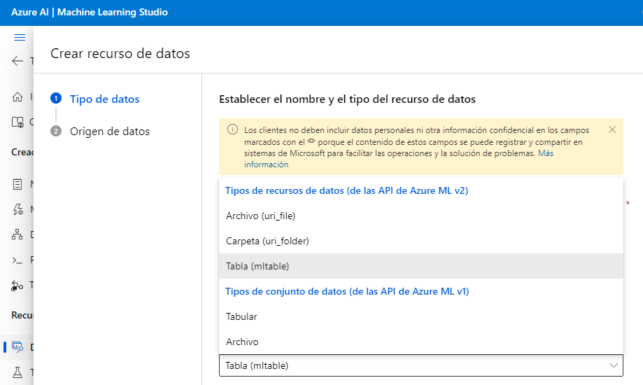

# RiskAnalyzers report

## Problem

## Set up the project workspace

- In this example, we are going to use the azure interface to create the workspace. To create an azure machine learning you need to do the following steps:

1. Go to portal.azure.com
2. Login with your Azure account
3. In the search bar type "azure machine learning" and select the first one
   

That will create:

- Storage account
- Azure machine learning workspace
- Azure workspace

4. Create a compute instance in _Azure Machine Learning Studio_
5. Download the configuration file in this tab
   
   So you will see the download link in the bottom
   
6. Upload the data for training and test to _Azure Machine Learning Studio_ in `MLTable` format. You need to go to the `Data` tab in the left bar and clic on create. After that, you select the type (`MLTable`) and upload the file
   

## Create the pipeline

We are going to create the code for the project locally, and with the azure machine learning library we are going to upload the pipeline to execute that with the cloud.

### Import Libraries

```Python
import logging
from azure.ai.ml import MLClient
from azure.identity import DefaultAzureCredential, InteractiveBrowserCredential
from azure.ai.ml.dsl import pipeline
from azure.ai.ml import Input,Output, automl, command
from azure.ai.ml.constants import AssetTypes
```

### Access to Azure Account

Is necessary to have the configuration file in the same path of the code.

```Python
try:
    credential = DefaultAzureCredential()
    # Check if given credential can get token successfully.
    credential.get_token("https://management.azure.com/.default")
except Exception as ex:
    # Fall back to InteractiveBrowserCredential in case DefaultAzureCredential not work
    credential = InteractiveBrowserCredential()

# Get a handle to workspace
ml_client = MLClient.from_config(credential=credential)
```

The previous code return the configuration credentials to access your azure resources, in this case it is going to return `.\config.json` that is our configuration file.

### Create the pipeline

We are going to create the pipeline without a configuration file `YAML` using the `@pipeline` decorator. We are going to test the following algorithms:

- Logistic Regression
- Light GBM
- Random Forest

```Python
# Define pipeline
@pipeline(
    description="AutoML Classification Pipeline",
    )
def automl_classification(
    classification_train_data,
    classification_validation_data
):
    # define the automl classification task with automl function
    classification_node = automl.classification(
        training_data=classification_train_data,
        validation_data=classification_validation_data,
        target_column_name="default", #name of the column
        primary_metric="accuracy", #decision metric
        # currently need to specify outputs "mlflow_model" explictly to reference it in following nodes
        outputs={"best_model": Output(type="mlflow_model")},
    )
    # set limits and training
    classification_node.set_limits(max_trials=1) # tries with a model
    classification_node.set_training(
        enable_stack_ensemble=False,
        enable_vote_ensemble=False,
        allowed_training_algorithms=['logistic_regression','light_gbm','random_forest'] #algorithms allowed
    )

    command_func = command(
        inputs=dict(
            automl_output=Input(type="mlflow_model")
        ),
        command="ls ${{inputs.automl_output}}",
        environment="azureml:AzureML-sklearn-0.24-ubuntu18.04-py37-cpu@latest"
    )
    show_output = command_func(automl_output=classification_node.outputs.best_model)
```

With that you create a definition for your pipeline. To execute the pipeline we need to pass the paths for the training and testing data and create the job to execute the pipeline.

```Python
URI_TRAIN_PATH = "YOUR_URI_PATH_TO_MLTABLE_IN_AZURE"
URI_TEST_PATH = "YOUR_URI_PATH_TO_MLTABLE_IN_AZURE"

try:
    pipeline_job = automl_classification(
        classification_train_data=Input(path=URI_TRAIN_PATH, type=AssetTypes.MLTABLE),
        classification_validation_data=Input(path=URI_TEST_PATH, type=AssetTypes.MLTABLE),
    )

    # Set pipeline level compute
    pipeline_job.settings.default_compute = "juan-risk"

    # Submit the pipeline job
    returned_pipeline_job = ml_client.jobs.create_or_update(
        pipeline_job,
        experiment_name="project-codigo-facilito"
    )

    logging.info("Pipeline job submitted successfully: %s", returned_pipeline_job)
except Exception as e:
    logging.error("An error occurred while creating or updating the pipeline job: %s", e)
    raise
```

> The instance selected in the previous code needs to be **ON** to execute the process

## Uploading the pipeline

You could find the pipeline execution in the `Job tab` and selecting the name of the experiment created `project-codigo-facilito`


The interface give you notification's messages if an step have an error or not. And the boxes of the steps turn to red if it had an error and green if it works well.

## Results

- Select the pipeline that has the name that you define in the definition:
  
- Expand the tab and you could see the main results:
  
  We see that the best model is `Light GBM` and had an 81% of accuracy, but if you select `show all metrics`, you will see the rest of the metrics:
  
- Select the output
  
- Select the resource URI to review the output data
  
  > It opens a new tab in your browser
- In the second tab you will see the outputs created by the pipeline
  
  We see the configuration file, ml flow model, compress model, python environment and requirements file

> Note: you could see the pipeline in the `pipeline tab` too.
